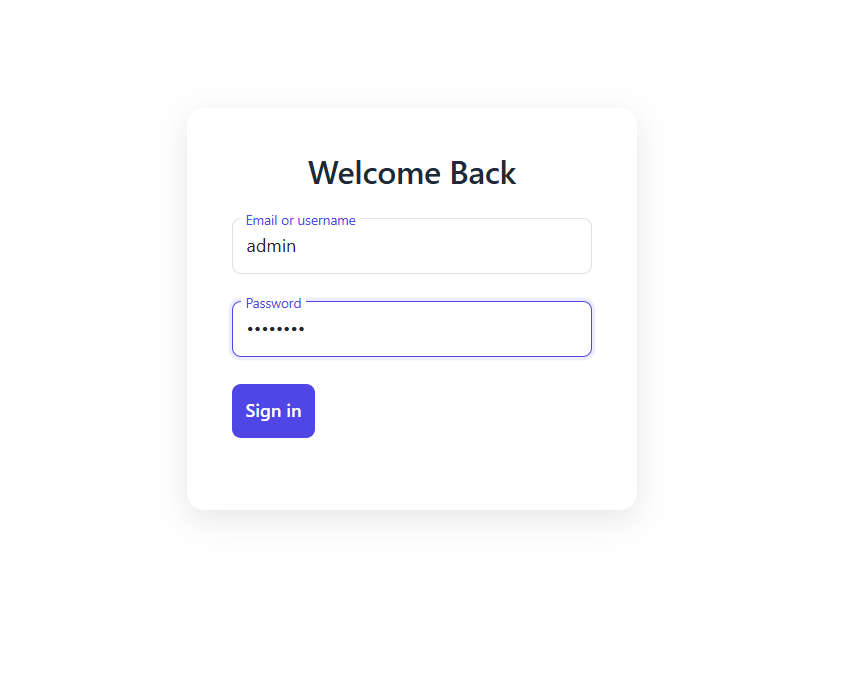
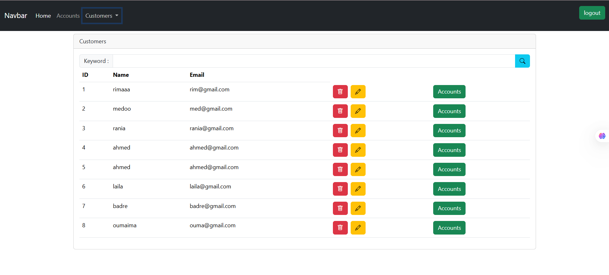
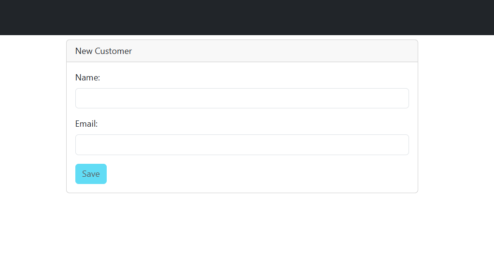
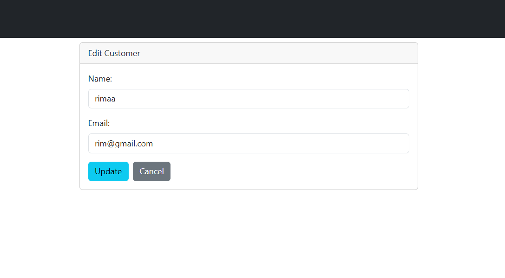
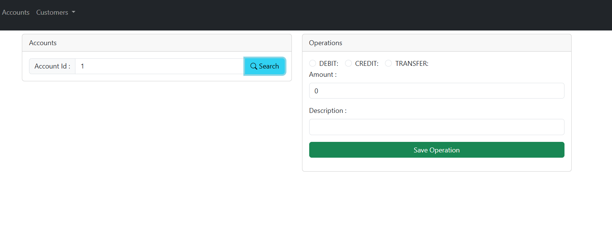

# 📌 Application Web JEE — BankingAPP

Projet réalisé dans le cadre du cours de **Spring JEE** dispensé par **Prof. Mohamed YOUSSFI**.

---

## 💡 Description

**BankingAPP** est une application de gestion bancaire développée avec **Spring Boot** pour le backend et **Angular** pour le frontend.  
Elle permet de gérer les clients, leurs comptes bancaires et leurs transactions, en utilisant **Spring Data JPA** pour la gestion de la base de données backend, et **MySQL** comme système de gestion de base de données relationnelle.

---

## 🚀 Fonctionnalités

### 👥 Client Management
- Ajout, modification, recherche, suppression et affichage des informations des clients.

### 🏦 Account Management
- Consultation des comptes bancaires et recherche par ID.

### 💸 Transaction Management
- Exécution de débits, crédits et transferts entre comptes.

### 🕘 History Management
- Affichage de l'historique des opérations pour chaque compte.

---

## 🛠️ Technologies utilisées

| Technologie        | Description                                      |
|--------------------|--------------------------------------------------|
| Java               | Langage de programmation principal pour le backend |
| Spring Boot        | Framework pour le développement du backend       |
| Spring Data JPA    | Accès aux données dans le backend                |
| MySQL              | Base de données relationnelle                    |
| Angular            | Framework frontend                               |
| TypeScript         | Langage de développement Angular                 |
| JWT                | Sécurité via JSON Web Token                      |
| Maven              | Gestionnaire de dépendances et build             |
| Git                | Contrôle de version                              |

---

## 📢 Notes

- 🚀 
- 🔧 

---

## 🔐 Sécurité

L’application intègre **Spring Security avec JWT** pour sécuriser les **API du backend**, tandis que le **frontend Angular** gère l'authentification via des intercepteurs.

### Fonctionnalités :
- Authentification via token JWT.
- Gestion des rôles : `USER`, `ADMIN`.
- Protection des endpoints :
  - Les endpoints de gestion des comptes sont accessibles uniquement après authentification.
  - Redirection ou erreur `403` en cas d’accès non autorisé.

---

## 📂 Structure du projet
```
structure Spring 

├───.mvn
│   └───wrapper
├───src
│   ├───main
│   │   ├───java
│   │   │   └───ma
│   │   │       └───enset
│   │   │           └───projet_jee_spring_angular_jwt
│   │   │               ├───dtos
│   │   │               ├───entities
│   │   │               ├───enums
│   │   │               ├───exceptions
│   │   │               ├───mappers
│   │   │               ├───repositories
│   │   │               ├───security
│   │   │               ├───services
│   │   │               └───web
│   │   └───resources
│   └───test
│       └───java
│           └───ma
│               └───enset
│                   └───projet_jee_spring_angular_jwt
└───target
    ├───classes
    │   └───ma
```
structure angular
```
├───public
└───src
    └───app
        ├───accounts
        ├───admin-template
        ├───customer-accounts
        ├───customers
        ├───edit-customer
        ├───interceptors
        ├───login
        ├───model
        ├───navbar
        ├───new-customer
        └───services
```
---

## 📸 Captures d’écran

### 📊 Page Login  

*Caption : Page de connexion sécurisée avec JWT*

### 📊 Client List  

*Caption : Liste des clients avec options d’édition et suppression*

### 🔍 Search an Account  

*Caption : Interface de recherche des comptes bancaires par ID*

### ➕ Add a Client  

*Caption : Formulaire d’ajout d’un nouveau client*

### ✏️ Edit a Client  

*Caption : Modification des informations d’un client existant*

### 🗑️ Account Operations

*Caption : Suppression d’un client depuis la base de données*

---

## 🧩 Exemples de code

### 🖥️ `Customer.java`
```java

package ma.enset.projet_jee_spring_angular_jwt.entities;

import com.fasterxml.jackson.annotation.JsonProperty;
import jakarta.persistence.*;
import lombok.AllArgsConstructor;
import lombok.Data;
import lombok.NoArgsConstructor;


import java.util.List;
@Entity
@Data @NoArgsConstructor @AllArgsConstructor
public class Customer {
    @Id @GeneratedValue(strategy = GenerationType.IDENTITY)
    private Long id;
    private String name;
    private String email;
    @OneToMany(mappedBy = "customer")
    @JsonProperty(access = JsonProperty.Access.WRITE_ONLY)
    private List<BankAccount> bankAccounts;
}
```
### 🖥️ `CustomerRepository.java`
```
package ma.enset.projet_jee_spring_angular_jwt.repositories;

import ma.enset.projet_jee_spring_angular_jwt.entities.Customer;
import org.springframework.data.jpa.repository.JpaRepository;
import org.springframework.data.jpa.repository.Query;
import org.springframework.data.repository.query.Param;

import java.util.List;

public interface CustomerRepository extends JpaRepository<Customer,Long> {
    @Query("select c from Customer c where c.name like :kw")
    List<Customer> searchCustomer(@Param("kw") String keyword);
}
```
### 🖥️ `BankAccountMapperImpl`
```
package ma.enset.projet_jee_spring_angular_jwt.mappers;


import ma.enset.projet_jee_spring_angular_jwt.dtos.AccountOperationDTO;
import ma.enset.projet_jee_spring_angular_jwt.dtos.CurrentBankAccountDTO;
import ma.enset.projet_jee_spring_angular_jwt.dtos.CustomerDTO;
import ma.enset.projet_jee_spring_angular_jwt.dtos.SavingBankAccountDTO;
import ma.enset.projet_jee_spring_angular_jwt.entities.AccountOperation;
import ma.enset.projet_jee_spring_angular_jwt.entities.CurrentAccount;
import ma.enset.projet_jee_spring_angular_jwt.entities.Customer;
import ma.enset.projet_jee_spring_angular_jwt.entities.SavingAccount;
import org.springframework.beans.BeanUtils;
import org.springframework.stereotype.Service;
@Service
public class BankAccountMapperImpl {
    public CustomerDTO fromCustomer(Customer customer){
        CustomerDTO customerDTO=new CustomerDTO();
        BeanUtils.copyProperties(customer,customerDTO);
        return  customerDTO;
    }
    public Customer fromCustomerDTO(CustomerDTO customerDTO){
        Customer customer=new Customer();
        BeanUtils.copyProperties(customerDTO,customer);
        return  customer;
    }

    public SavingBankAccountDTO fromSavingBankAccount(SavingAccount savingAccount){
        SavingBankAccountDTO savingBankAccountDTO=new SavingBankAccountDTO();
        BeanUtils.copyProperties(savingAccount,savingBankAccountDTO);
        savingBankAccountDTO.setCustomerDTO(fromCustomer(savingAccount.getCustomer()));
        savingBankAccountDTO.setType(savingAccount.getClass().getSimpleName());
        return savingBankAccountDTO;
    }

    public SavingAccount fromSavingBankAccountDTO(SavingBankAccountDTO savingBankAccountDTO){
        SavingAccount savingAccount=new SavingAccount();
        BeanUtils.copyProperties(savingBankAccountDTO,savingAccount);
        savingAccount.setCustomer(fromCustomerDTO(savingBankAccountDTO.getCustomerDTO()));
        return savingAccount;
    }

    public CurrentBankAccountDTO fromCurrentBankAccount(CurrentAccount currentAccount){
        CurrentBankAccountDTO currentBankAccountDTO=new CurrentBankAccountDTO();
        BeanUtils.copyProperties(currentAccount,currentBankAccountDTO);
        currentBankAccountDTO.setCustomerDTO(fromCustomer(currentAccount.getCustomer()));
        currentBankAccountDTO.setType(currentAccount.getClass().getSimpleName());
        return currentBankAccountDTO;
    }

    public CurrentAccount fromCurrentBankAccountDTO(CurrentBankAccountDTO currentBankAccountDTO){
        CurrentAccount currentAccount=new CurrentAccount();
        BeanUtils.copyProperties(currentBankAccountDTO,currentAccount);
        currentAccount.setCustomer(fromCustomerDTO(currentBankAccountDTO.getCustomerDTO()));
        return currentAccount;
    }

    public AccountOperationDTO fromAccountOperation(AccountOperation accountOperation){
        AccountOperationDTO accountOperationDTO=new AccountOperationDTO();
        BeanUtils.copyProperties(accountOperation,accountOperationDTO);
        return accountOperationDTO;
    }

}
```
### 🖥️ `CustomerRestController`
```
package ma.enset.projet_jee_spring_angular_jwt.web;

import lombok.AllArgsConstructor;
import lombok.extern.slf4j.Slf4j;

import ma.enset.projet_jee_spring_angular_jwt.dtos.BankAccountDTO;
import ma.enset.projet_jee_spring_angular_jwt.dtos.CustomerDTO;
import ma.enset.projet_jee_spring_angular_jwt.exceptions.CustomerNotFoundException;
import ma.enset.projet_jee_spring_angular_jwt.services.BankAccountService;
import org.springframework.security.access.prepost.PreAuthorize;
import org.springframework.web.bind.annotation.*;

import java.util.List;

@RestController
@AllArgsConstructor
@Slf4j
@CrossOrigin("*")
public class CustomerRestController {
    private BankAccountService bankAccountService;

    @GetMapping("/customers")
    @PreAuthorize("hasAuthority('SCOPE_USER')")
    public List<CustomerDTO> customers(){
        return bankAccountService.listCustomers();
    }

    @GetMapping("/customers/search")
    @PreAuthorize("hasAuthority('SCOPE_USER')")
    public List<CustomerDTO> searchCustomers(@RequestParam(name = "keyword",defaultValue = "") String keyword){
        return bankAccountService.searchCustomers("%"+keyword+"%");
    }

    @PreAuthorize("hasAuthority('SCOPE_USER')")
    @GetMapping("/customers/{id}")
    public CustomerDTO getCustomer(@PathVariable(name = "id") Long customerId) throws CustomerNotFoundException {
        return bankAccountService.getCustomer(customerId);
    }

    @PostMapping("/customers")
    @PreAuthorize("hasAuthority('SCOPE_ADMIN')")
    public CustomerDTO saveCustomer(@RequestBody CustomerDTO customerDTO){
        return bankAccountService.saveCustomer(customerDTO);
    }
    @PutMapping("/customers/{customerId}")
    @PreAuthorize("hasAuthority('SCOPE_ADMIN')")
    public CustomerDTO updateCustomer(@PathVariable Long customerId, @RequestBody CustomerDTO customerDTO){
        customerDTO.setId(customerId);
        return bankAccountService.updateCustomer(customerDTO);
    }
    @DeleteMapping("/customers/{id}")
    @PreAuthorize("hasAuthority('SCOPE_ADMIN')")
    public void deleteCustomer(@PathVariable Long id){
        bankAccountService.deleteCustomer(id);
    }
    @GetMapping("/{customerId}/accounts")
    @PreAuthorize("hasAuthority('SCOPE_ADMIN')")
    public List<BankAccountDTO> getCustomerAccounts(@PathVariable Long customerId) {
        return bankAccountService.getAccountsByCustomerId(customerId);
    }
}
```
### 🖥️ `BankAccountsServices`
```
package ma.enset.projet_jee_spring_angular_jwt.services;

import lombok.AllArgsConstructor;
import lombok.extern.slf4j.Slf4j;

import ma.enset.projet_jee_spring_angular_jwt.dtos.*;
import ma.enset.projet_jee_spring_angular_jwt.entities.*;
import ma.enset.projet_jee_spring_angular_jwt.enums.OperationType;
import ma.enset.projet_jee_spring_angular_jwt.exceptions.BalanceNotSufficientException;
import ma.enset.projet_jee_spring_angular_jwt.exceptions.BankAccountNotFoundException;
import ma.enset.projet_jee_spring_angular_jwt.exceptions.CustomerNotFoundException;
import ma.enset.projet_jee_spring_angular_jwt.mappers.BankAccountMapperImpl;
import ma.enset.projet_jee_spring_angular_jwt.repositories.AccountOperationRepository;
import ma.enset.projet_jee_spring_angular_jwt.repositories.BankAccountRepository;
import ma.enset.projet_jee_spring_angular_jwt.repositories.CustomerRepository;
import org.springframework.data.domain.Page;
import org.springframework.data.domain.PageRequest;
import org.springframework.stereotype.Service;
import org.springframework.transaction.annotation.Transactional;

import java.util.Date;
import java.util.List;
import java.util.UUID;
import java.util.stream.Collectors;

@Service
@Transactional
@AllArgsConstructor
@Slf4j
public  class BankAccountServiceImpl implements BankAccountService {
    private CustomerRepository customerRepository;
    private BankAccountRepository bankAccountRepository;
    private AccountOperationRepository accountOperationRepository;
    private BankAccountMapperImpl dtoMapper;

    @Override
    public CustomerDTO saveCustomer(CustomerDTO customerDTO) {
        log.info("Saving new Customer");
        Customer customer=dtoMapper.fromCustomerDTO(customerDTO);
        Customer savedCustomer = customerRepository.save(customer);
        return dtoMapper.fromCustomer(savedCustomer);
    }

    @Override
    public CurrentBankAccountDTO saveCurrentBankAccount(double initialBalance, double overDraft, Long customerId) throws CustomerNotFoundException {
        Customer customer=customerRepository.findById(customerId).orElse(null);
        if(customer==null)
            throw new CustomerNotFoundException("Customer not found");
        CurrentAccount currentAccount=new CurrentAccount();
        currentAccount.setId(UUID.randomUUID().toString());
        currentAccount.setCreatedAt(new Date());
        currentAccount.setBalance(initialBalance);
        currentAccount.setOverDraft(overDraft);
        currentAccount.setCustomer(customer);
        CurrentAccount savedBankAccount = bankAccountRepository.save(currentAccount);
        return dtoMapper.fromCurrentBankAccount(savedBankAccount);
    }

    @Override
    public SavingBankAccountDTO saveSavingBankAccount(double initialBalance, double interestRate, Long customerId) throws CustomerNotFoundException {
        Customer customer=customerRepository.findById(customerId).orElse(null);
        if(customer==null)
            throw new CustomerNotFoundException("Customer not found");
        SavingAccount savingAccount=new SavingAccount();
        savingAccount.setId(UUID.randomUUID().toString());
        savingAccount.setCreatedAt(new Date());
        savingAccount.setBalance(initialBalance);
        savingAccount.setInterestRate(interestRate);
        savingAccount.setCustomer(customer);
        SavingAccount savedBankAccount = bankAccountRepository.save(savingAccount);
        return dtoMapper.fromSavingBankAccount(savedBankAccount);
    }

    @Override
    public List<CustomerDTO> listCustomers() {
        List<Customer> customers = customerRepository.findAll();
        List<CustomerDTO> customerDTOS = customers.stream()
                .map(customer -> dtoMapper.fromCustomer(customer))
                .collect(Collectors.toList());
        /*
        List<CustomerDTO> customerDTOS=new ArrayList<>();
        for (Customer customer:customers){
            CustomerDTO customerDTO=dtoMapper.fromCustomer(customer);
            customerDTOS.add(customerDTO);
        }
        *
         */
        return customerDTOS;
    }

    @Override
    public BankAccountDTO getBankAccount(String accountId) throws BankAccountNotFoundException {
        BankAccount bankAccount=bankAccountRepository.findById(accountId)
                .orElseThrow(()->new BankAccountNotFoundException("BankAccount not found"));
        if(bankAccount instanceof SavingAccount){
            SavingAccount savingAccount= (SavingAccount) bankAccount;
            return dtoMapper.fromSavingBankAccount(savingAccount);
        } else {
            CurrentAccount currentAccount= (CurrentAccount) bankAccount;
            return dtoMapper.fromCurrentBankAccount(currentAccount);
        }
    }

    @Override
    public void debit(String accountId, double amount, String description) throws BankAccountNotFoundException, BalanceNotSufficientException {
        BankAccount bankAccount=bankAccountRepository.findById(accountId)
                .orElseThrow(()->new BankAccountNotFoundException("BankAccount not found"));
        if(bankAccount.getBalance()<amount)
            throw new BalanceNotSufficientException("Balance not sufficient");
        AccountOperation accountOperation=new AccountOperation();
        accountOperation.setType(OperationType.DEBIT);
        accountOperation.setAmount(amount);
        accountOperation.setDescription(description);
        accountOperation.setOperationDate(new Date());
        accountOperation.setBankAccount(bankAccount);
        accountOperationRepository.save(accountOperation);
        bankAccount.setBalance(bankAccount.getBalance()-amount);
        bankAccountRepository.save(bankAccount);
    }

    @Override
    public void credit(String accountId, double amount, String description) throws BankAccountNotFoundException {
        BankAccount bankAccount=bankAccountRepository.findById(accountId)
                .orElseThrow(()->new BankAccountNotFoundException("BankAccount not found"));
        AccountOperation accountOperation=new AccountOperation();
        accountOperation.setType(OperationType.CREDIT);
        accountOperation.setAmount(amount);
        accountOperation.setDescription(description);
        accountOperation.setOperationDate(new Date());
        accountOperation.setBankAccount(bankAccount);
        accountOperationRepository.save(accountOperation);
        bankAccount.setBalance(bankAccount.getBalance()+amount);
        bankAccountRepository.save(bankAccount);
    }

    @Override
    public void transfer(String accountIdSource, String accountIdDestination, double amount) throws BankAccountNotFoundException, BalanceNotSufficientException {
        debit(accountIdSource,amount,"Transfer to "+accountIdDestination);
        credit(accountIdDestination,amount,"Transfer from "+accountIdSource);
    }
    @Override
    public List<BankAccountDTO> bankAccountList(){
        List<BankAccount> bankAccounts = bankAccountRepository.findAll();
        List<BankAccountDTO> bankAccountDTOS = bankAccounts.stream().map(bankAccount -> {
            if (bankAccount instanceof SavingAccount) {
                SavingAccount savingAccount = (SavingAccount) bankAccount;
                return dtoMapper.fromSavingBankAccount(savingAccount);
            } else {
                CurrentAccount currentAccount = (CurrentAccount) bankAccount;
                return dtoMapper.fromCurrentBankAccount(currentAccount);
            }
        }).collect(Collectors.toList());
        return bankAccountDTOS;
    }
    @Override
    public CustomerDTO getCustomer(Long customerId) throws CustomerNotFoundException {
        Customer customer = customerRepository.findById(customerId)
                .orElseThrow(() -> new CustomerNotFoundException("Customer Not found"));
        return dtoMapper.fromCustomer(customer);
    }

    @Override
    public CustomerDTO updateCustomer(CustomerDTO customerDTO) {
        log.info("Saving new Customer");
        Customer customer=dtoMapper.fromCustomerDTO(customerDTO);
        Customer savedCustomer = customerRepository.save(customer);
        return dtoMapper.fromCustomer(savedCustomer);
    }
    @Override
    public void deleteCustomer(Long customerId){
        customerRepository.deleteById(customerId);
    }
    @Override
    public List<AccountOperationDTO> accountHistory(String accountId){
        List<AccountOperation> accountOperations = accountOperationRepository.findByBankAccountId(accountId);
        return accountOperations.stream().map(op->dtoMapper.fromAccountOperation(op)).collect(Collectors.toList());
    }

    @Override
    public AccountHistoryDTO getAccountHistory(String accountId, int page, int size) throws BankAccountNotFoundException {
        BankAccount bankAccount=bankAccountRepository.findById(accountId).orElse(null);
        if(bankAccount==null) throw new BankAccountNotFoundException("Account not Found");
        Page<AccountOperation> accountOperations = accountOperationRepository.findByBankAccountIdOrderByOperationDateDesc(accountId, PageRequest.of(page, size));
        AccountHistoryDTO accountHistoryDTO=new AccountHistoryDTO();
        List<AccountOperationDTO> accountOperationDTOS = accountOperations.getContent().stream().map(op -> dtoMapper.fromAccountOperation(op)).collect(Collectors.toList());
        accountHistoryDTO.setAccountOperationDTOS(accountOperationDTOS);
        accountHistoryDTO.setAccountId(bankAccount.getId());
        accountHistoryDTO.setBalance(bankAccount.getBalance());
        accountHistoryDTO.setCurrentPage(page);
        accountHistoryDTO.setPageSize(size);
        accountHistoryDTO.setTotalPages(accountOperations.getTotalPages());
        return accountHistoryDTO;
    }

    @Override
    public List<CustomerDTO> searchCustomers(String keyword) {
        List<Customer> customers=customerRepository.searchCustomer(keyword);
        List<CustomerDTO> customerDTOS = customers.stream().map(cust -> dtoMapper.fromCustomer(cust)).collect(Collectors.toList());
        return customerDTOS;
    }

    public List<BankAccountDTO> getAccountsByCustomerId(Long customerId) {
        List<BankAccount> accounts= bankAccountRepository.findByCustomerId(customerId);
        List<BankAccountDTO> accountDTOS = accounts.stream().map(bankAccount -> {
            if (bankAccount instanceof SavingAccount) {
                SavingAccount savingAccount = (SavingAccount) bankAccount;
                return dtoMapper.fromSavingBankAccount(savingAccount);
            } else {
                CurrentAccount currentAccount = (CurrentAccount) bankAccount;
                return dtoMapper.fromCurrentBankAccount(currentAccount);
            }
        }).collect(Collectors.toList());
        return accountDTOS;

    }
}
```
### 🖥️ `SecurityConfig.java`
```
package ma.enset.projet_jee_spring_angular_jwt.security;

import com.nimbusds.jose.jwk.source.ImmutableSecret;
import org.springframework.beans.factory.annotation.Value;
import org.springframework.context.annotation.Bean;
import org.springframework.context.annotation.Configuration;
import org.springframework.security.authentication.AuthenticationManager;
import org.springframework.security.authentication.ProviderManager;
import org.springframework.security.authentication.dao.DaoAuthenticationProvider;
import org.springframework.security.config.Customizer;
import org.springframework.security.config.annotation.method.configuration.EnableMethodSecurity;
import org.springframework.security.config.annotation.web.builders.HttpSecurity;
import org.springframework.security.config.annotation.web.configuration.EnableWebSecurity;
import org.springframework.security.config.annotation.web.configurers.AbstractHttpConfigurer;
import org.springframework.security.config.http.SessionCreationPolicy;
import org.springframework.security.core.userdetails.User;
import org.springframework.security.core.userdetails.UserDetailsService;
import org.springframework.security.crypto.bcrypt.BCryptPasswordEncoder;
import org.springframework.security.crypto.password.PasswordEncoder;
import org.springframework.security.oauth2.jose.jws.MacAlgorithm;
import org.springframework.security.oauth2.jwt.JwtDecoder;
import org.springframework.security.oauth2.jwt.JwtEncoder;
import org.springframework.security.oauth2.jwt.NimbusJwtDecoder;
import org.springframework.security.oauth2.jwt.NimbusJwtEncoder;
import org.springframework.security.provisioning.InMemoryUserDetailsManager;
import org.springframework.security.web.SecurityFilterChain;
import org.springframework.web.cors.CorsConfiguration;
import org.springframework.web.cors.CorsConfigurationSource;
import org.springframework.web.cors.UrlBasedCorsConfigurationSource;

import javax.crypto.spec.SecretKeySpec;

@Configuration
@EnableWebSecurity
@EnableMethodSecurity(prePostEnabled = true)
public class SecurityConfig {

    @Value( "${jwt.secret}")
    private String secretKey;

    @Bean
    public InMemoryUserDetailsManager inMemoryUserDetailsManager() {
        return new InMemoryUserDetailsManager(
                User.withUsername("user").password(passwordEncoder().encode("password")).authorities("USER").build(),
                User.withUsername("admin").password(passwordEncoder().encode("password")).authorities("USER", "ADMIN").build()
        );
    }

    @Bean
    public PasswordEncoder passwordEncoder() {
        return new BCryptPasswordEncoder();
    }

    @Bean
    public SecurityFilterChain securityFilterChain(HttpSecurity httpSecurity) throws Exception {
        return httpSecurity
                .sessionManagement(sm -> sm.sessionCreationPolicy(SessionCreationPolicy.STATELESS))
                .csrf(AbstractHttpConfigurer::disable)
                .cors(Customizer.withDefaults())
                .authorizeHttpRequests(auth -> auth
                        .requestMatchers("/auth/login").permitAll() // Allow login
                        .anyRequest().permitAll()
                )
                .oauth2ResourceServer(oa->oa.jwt(Customizer.withDefaults()))
                .build();
    }

    @Bean
    public JwtEncoder jwtEncoder() {
        return new NimbusJwtEncoder(new ImmutableSecret<>(secretKey.getBytes()));
    }

    @Bean
    public JwtDecoder jwtDecoder() {
        SecretKeySpec secretKeySpec = new SecretKeySpec(secretKey.getBytes(), "RSA");
        return NimbusJwtDecoder.withSecretKey(secretKeySpec).macAlgorithm(MacAlgorithm.HS512).build();
    }

    @Bean
    public AuthenticationManager authenticationManager(UserDetailsService userDetailsService) {
        DaoAuthenticationProvider provider = new DaoAuthenticationProvider();
        provider.setPasswordEncoder(passwordEncoder());
        provider.setUserDetailsService(userDetailsService);

        return new ProviderManager(provider);
    }

    @Bean
    public CorsConfigurationSource corsConfigurationSource() {
        CorsConfiguration corsConfiguration = new CorsConfiguration();
        corsConfiguration.addAllowedOrigin("*");
        corsConfiguration.addAllowedHeader("*");
        corsConfiguration.addAllowedMethod("*");
        UrlBasedCorsConfigurationSource source = new UrlBasedCorsConfigurationSource();
        source.registerCorsConfiguration("/**", corsConfiguration);
        return source;
    }

}
```

### 🖥️ `customers.component.html`
```
<div class="container mt-2">
  <ng-container *ngIf="customers | async as listCustomers; else failureOrLading">
    <div class="card">
      <div class="card-header">Customers</div>
      <div class="card-body">
        <div *ngIf="searchFormGroup">
          <form [formGroup]="searchFormGroup" (ngSubmit)="handleSearchCustomers()">
            <div class="input-group">
              <label class="input-group-text">Keyword :</label>
              <input type="text" formControlName="keyword" class="form-control">
              <button class="btn btn-info">
                <i class="bi bi-search"></i>
              </button>
            </div>
          </form>
        </div>
        <table class="table">
          <thead>
          <tr>
            <th>ID</th><th>Name</th><th>Email</th>
          </tr>
          </thead>
          <tbody>
          <tr *ngFor="let c of listCustomers"> <!-- Utilisation de listCustomers au lieu de customers | async -->
            <td>{{c.id}}</td>
            <td>{{c.name}}</td>
            <td>{{c.email}}</td>
            <td>
              <button (click)="handleDeleteCustomer(c)" class="btn btn-danger me-2">
                <i class="bi bi-trash"></i>
              </button>
              <button (click)="handleEditCustomer(c)" class="btn btn-warning">
                <i class="bi bi-pencil"></i>
              </button>
            </td>
            <td>
              <button (click)="handleCustomerAccounts(c)" class="btn btn-success">
                Accounts
              </button>
            </td>
          </tr>
          </tbody>
        </table>
      </div>
    </div>
  </ng-container>
  <ng-template #failureOrLading>
    <ng-container *ngIf="errorMessage; else loading">
      <div class="text-danger">
        {{errorMessage}}
      </div>
    </ng-container>
    <ng-template #loading>
      Loading .....
    </ng-template>
  </ng-template>
</div>
```
### 🖥️ `customers.component.ts`
```
import {Component, OnInit} from '@angular/core';
import {catchError, map, Observable, throwError} from 'rxjs';
import {Customer} from '../model/customer.model';
import {FormBuilder, FormGroup, ReactiveFormsModule} from '@angular/forms';
import {CustomerService} from '../services/customer.service';
import { Router } from '@angular/router';
import {AsyncPipe, NgForOf, NgIf} from '@angular/common';

@Component({
  selector: 'app-customers',
  standalone: true,
  imports: [
    ReactiveFormsModule,
    NgIf,
    AsyncPipe,
    NgForOf
  ],
  templateUrl: './customers.component.html',
  styleUrls: ['./customers.component.css']
})
export class CustomersComponent implements OnInit {
  customers! : Observable<Array<Customer>>;
  errorMessage!: string;
  searchFormGroup : FormGroup | undefined;
  constructor(private customerService : CustomerService, private fb : FormBuilder, private router : Router) { }

  ngOnInit(): void {
    this.searchFormGroup=this.fb.group({
      keyword : this.fb.control("")
    });
    this.handleSearchCustomers();
  }
  handleSearchCustomers() {
    let kw=this.searchFormGroup?.value.keyword;
    this.customers=this.customerService.searchCustomers(kw).pipe(
      catchError(err => {
        this.errorMessage=err.message;
        return throwError(err);
      })
    );
  }

  handleDeleteCustomer(c: Customer) {
    let conf = confirm("Are you sure?");
    if(!conf) return;
    this.customerService.deleteCustomer(c.id).subscribe({
      next : (resp) => {
        this.customers=this.customers.pipe(
          map(data=>{
            let index=data.indexOf(c);
            data.slice(index,1)
            return data;
          })
        );
      },
      error : err => {
        console.log(err);
      }
    })
  }


  handleCustomerAccounts(c: Customer) {
    this.router.navigateByUrl("/admin/customer-accounts/"+c.id);
  }

  handleEditCustomer(c: Customer) {
    this.router.navigateByUrl("/admin/edit-customer/"+c.id,{ state: c });
  }

}
```
### 🖥️ `app.routes.ts`
```
import { NgModule } from '@angular/core';
import { RouterModule, Routes } from '@angular/router';
import {AccountsComponent} from './accounts/accounts.component';
import {CustomersComponent} from './customers/customers.component';
import {NewCustomerComponent} from './new-customer/new-customer.component';
import {CustomerAccountsComponent} from './customer-accounts/customer-accounts.component';
import {EditCustomerComponent} from './edit-customer/edit-customer.component';
import {LoginComponent} from './login/login.component';
import {AdminTemplateComponent} from './admin-template/admin-template.component';

export const routes: Routes = [
  {path :"login" , component : LoginComponent},
  { path: '', redirectTo: '/login', pathMatch: 'full' },
  {path:"admin",component:AdminTemplateComponent,children:[
      { path :"customers", component : CustomersComponent},
      { path :"accounts", component : AccountsComponent},
      { path :"new-customer", component : NewCustomerComponent},
      { path :"customer-accounts/:id", component : CustomerAccountsComponent},
      { path: 'edit-customer/:id', component: EditCustomerComponent },
    ]}

];

@NgModule({
  imports: [RouterModule.forRoot(routes)],
  exports: [RouterModule]
})
export class AppRoutingModule { }
```
### 🖥️ `customer.service.ts`
```
import { Injectable } from '@angular/core';
import { HttpClient } from '@angular/common/http';
import { Observable } from 'rxjs';
import { Customer } from '../model/customer.model';

@Injectable({
  providedIn: 'root'
})
export class CustomerService {
  backendHost = 'http://localhost:8085';

  constructor(private http: HttpClient) {}

  public getCustomers(): Observable<Array<Customer>> {
    return this.http.get<Array<Customer>>(`${this.backendHost}/customers`);
  }

  public searchCustomers(keyword: string): Observable<Array<Customer>> {
    return this.http.get<Array<Customer>>(`${this.backendHost}/customers/search?keyword=${keyword}`);
  }

  public saveCustomer(customer: Customer): Observable<Customer> {
    return this.http.post<Customer>(`${this.backendHost}/customers`, customer);
  }

  public deleteCustomer(id: number): Observable<void> {
    return this.http.delete<void>(`${this.backendHost}/customers/${id}`);
  }

  public getCustomerAccounts(customerId: number): Observable<any[]> {
    return this.http.get<any[]>(`${this.backendHost}/${customerId}/accounts`); // Correction de l'URL
  }

  // Nouvelle méthode pour récupérer un client par ID
  public getCustomerById(id: number): Observable<Customer> {
    return this.http.get<Customer>(`${this.backendHost}/customers/${id}`);
  }

  // Nouvelle méthode pour mettre à jour un client
  public updateCustomer(id: number, customer: Customer): Observable<Customer> {
    return this.http.put<Customer>(`${this.backendHost}/customers/${id}`, customer);
  }
}
```

## 🎥 Vidéos de Cours
Ces vidéos ont été réalisées par **Prof. Mohamed YOUSSFI** dans le cadre du cours **Spring Boot & Angular** :

### 📌 Partie 1 : presentation de projet  
- [Présentation du Projet](https://www.youtube.com/watch?v=x6gFWmRxNPE&authuser=0)

### 📌 Partie 2 : backend 
- [video 1](https://www.youtube.com/watch?v=muuFQWnCQd0&authuser=0)
- [video 2](https://www.youtube.com/watch?v=PTI8cniOXLc)

### 📌 Partie 3 :Client
- [Client Angular](https://www.youtube.com/watch?v=bOoPKctcE0s )
- 
### 📌 Partie 4 : Sécurité avec Spring Security  

1. [Sécuriser l'application avec système d'authentification]( https://www.youtube.com/watch?v=n65zFfl9dqA&authuser=0)


---

### ✅ Consignes

- 🛠️ Créer un **repository GitHub**.
- 💾 Effectuer un **commit et push toutes les 30 minutes** environ.
- 📝 Utiliser ce fichier **`README.md`** pour rédiger le rapport du projet.
- 📅 Faire un **dernier commit avant le 01 Juin 2025 à 13:30**.
- 🔧 Poursuivre ensuite le développement et **compléter l’activité pratique**.

---

### 💌 Auteur

👩‍💻 **Rim Aaloi**  
💌 Contact: [GitHub Profile](https://github.com/RimAaloi) | [LinkedIn](https://www.linkedin.com/in/rim-aaloi/)  

---

### 📚 Ressources

- 📘 [Spring Documentation](https://spring.io/docs)
- 📘 [Angular Documentation](https://angular.io/docs)
- 📘 [MySQL Documentation](https://dev.mysql.com/doc/)
